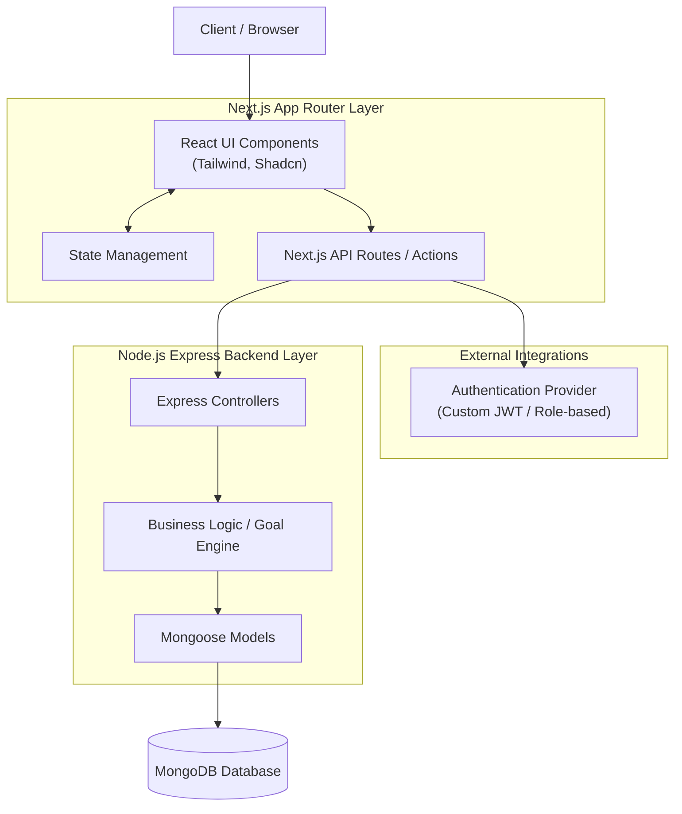

# AtomQuest Goal Setting & Tracking Portal

AtomQuest is a premium, enterprise-grade Goal Setting and Tracking Portal designed to modernize employee performance management with real-time KPI tracking and quarterly check-ins. This platform enables employees to set goals, managers to review and approve them, and administrators to gain insights into organizational progress.

## Overview

This repository contains the foundation for the AtomQuest portal. It is built to deliver a highly user-friendly, responsive, and minimalist experience reminiscent of modern SaaS platforms (like Notion, Linear, and Stripe).

### Features
- **Goal Creation**: Employees can seamlessly create personal and OKR-based goals.
- **Manager Reviews**: Managers can review, approve, and align goals.
- **Quarterly Tracking**: Easy check-ins and performance tracking.
- **Analytics Dashboard**: Insights on organizational performance (planned).
- **Role-based Authentication**: Secure access for Employees, Managers, and Admins.

## Tech Stack

- **Frontend**: Next.js 15 (App Router), TypeScript, Tailwind CSS
- **UI Architecture**: Shadcn UI, Framer Motion, Lucide React
- **Backend Architecture**: Prepared for Node.js / Express integration
- **Database Architecture**: Prepared for MongoDB

## Architecture Diagram



## Folder Structure

```
src/
 ├── app/             # Next.js App Router (Pages, Layouts)
 ├── components/      # React Components
 │    ├── ui/         # Shadcn reusable UI components
 │    ├── landing/    # Landing page specific components
 │    ├── auth/       # Authentication specific components
 │    └── shared/     # Shared layouts and components
 ├── lib/             # Utility functions and core configurations
 ├── constants/       # App-wide static configurations
 ├── store/           # State management hooks
 ├── services/        # External API communication functions
 ├── types/           # TypeScript generic type definitions
```

## Setup Instructions

### Prerequisites
- Node.js 18+
- npm or yarn or pnpm

### Run Locally

1. Clone the repository and navigate into the project directory.
2. Copy the example environment variables:
   ```bash
   cp .env.example .env.local
   ```
3. Install dependencies:
   ```bash
   npm install
   ```
4. Start the development server:
   ```bash
   npm run dev
   ```
5. Open [http://localhost:3000](http://localhost:3000) in your browser.

## Deployment Instructions

### Frontend (Vercel)
The Next.js application is optimized for deployment on Vercel. Connect your repository to Vercel and it will automatically configure the build settings.

### Backend (Render/Railway)
The Node.js Express backend can be deployed via Render or Railway using standard Docker or Node.js environments. Remember to supply your MongoDB connection string in the production environment.

## Future Roadmap

- Fully integrate Employee, Manager, and Admin dashboards.
- Implement robust JWT Authentication and Route Guards.
- Build the OKR alignment engine.
- Establish the comprehensive Analytics module and Audit Logging system.
