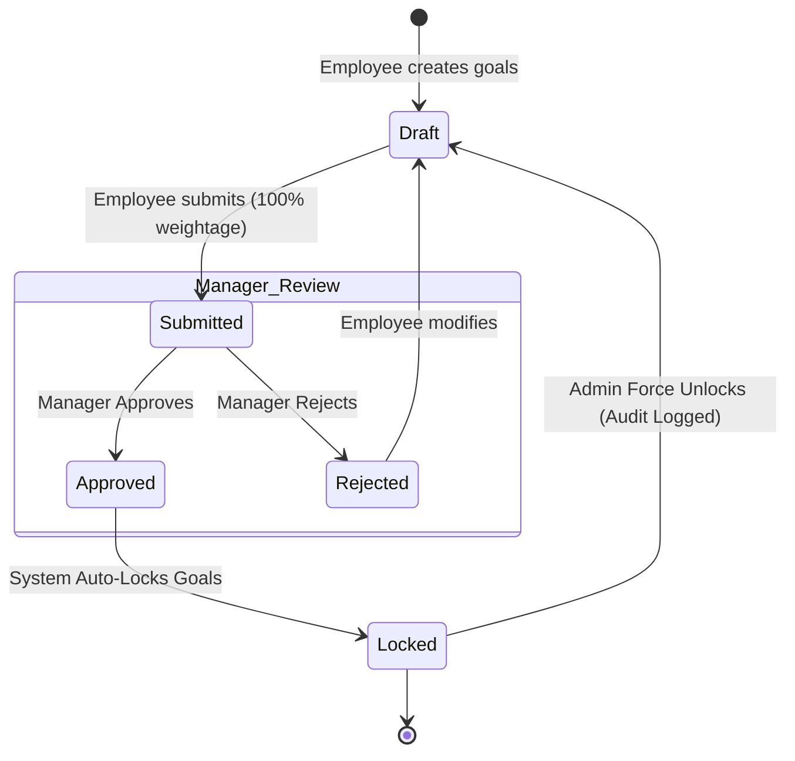
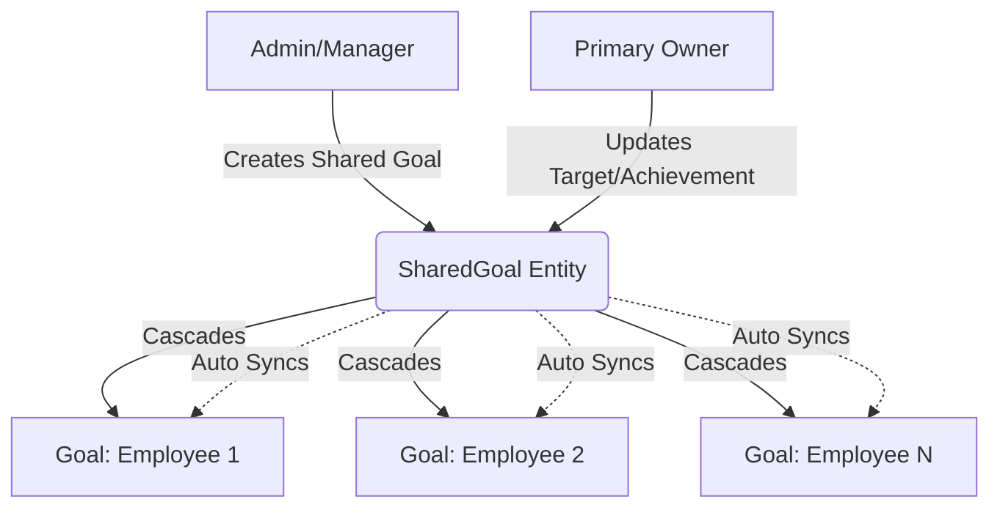
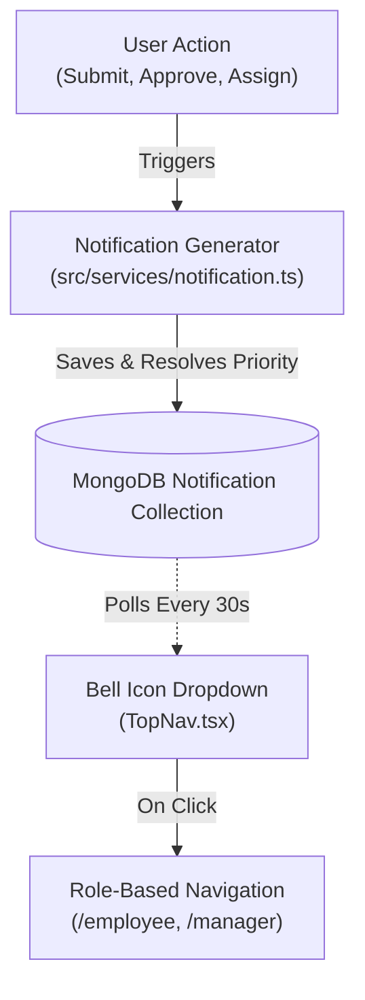
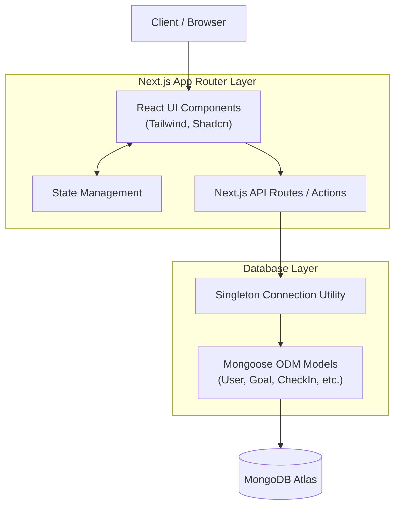
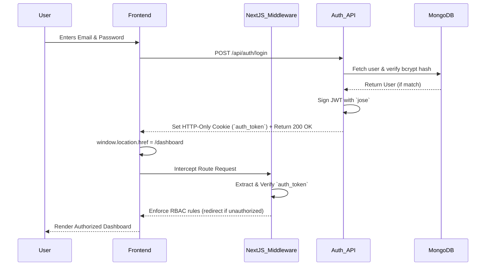

# AtomQuest Goal Setting & Tracking Portal

AtomQuest is a premium, enterprise-grade Goal Setting and Tracking Portal designed to modernize employee performance management with real-time KPI tracking and quarterly check-ins. This platform enables employees to set goals, managers to review and approve them, and administrators to gain insights into organizational progress.

## Overview

This repository contains the foundation for the AtomQuest portal. It is built to deliver a highly user-friendly, responsive, and minimalist experience reminiscent of modern SaaS platforms (like Notion, Linear, and Stripe).

### Features
- **[Phase 1] Goal Creation & Employee Dashboard (COMPLETED)**
- **[Phase 1] Dynamic Manager Dashboard & Approval System (COMPLETED)**
- **[Phase 1] Real-time Shared Goals Management (COMPLETED)**
- **[Phase 1] System-wide Notifications & Alerts (COMPLETED)**
- [Phase 2] Quarterly Check-ins & Continuous Feedback
- [Phase 3] Advanced Analytics & PDF Exporting

---

## 🏗 Phase 1 Architecture (Implemented)

### 1. Goal Lifecycle Workflow



### 2. Shared Goals Cascading Engine



### 3. Notification Architecture & Event Flow



#### API Documentation
- `GET /api/notifications` - Fetch latest unread/read notifications for the logged-in user.
- `PUT /api/notifications/read-all` - Mark all notifications as read.
- `PUT /api/notifications/:id/read` - Mark a single notification as read.
- `DELETE /api/notifications/:id` - Delete a specific notification.

---

## 🔒 Security & Middleware

- **Role-based Authentication**: Secure access for Employees, Managers, and Admins.

## Tech Stack

- **Frontend**: Next.js 15 (App Router), TypeScript, Tailwind CSS
- **UI Architecture**: Shadcn UI, Framer Motion, Lucide React
- **Backend Architecture**: Next.js API Routes (Serverless)
- **Database Architecture**: MongoDB Atlas with Mongoose ODM

## Architecture Diagram



## Database Schema Overview
The architecture implements the following robust Mongoose schemas:
- **User**: Captures identity, roles (employee, manager, admin), and relationships.
- **Goal**: Core entity tracking targets, thrust areas, and quarterly weightings. Supports dynamic Unit of Measurement (`numeric`, `percentage`, `timeline`, `zero`) via `targetValue` and `targetDate`.
- **GoalSheet**: Container linking multiple goals to a specific quarter/year for an employee. Contains strict `status` and `locked` control layers for the approval workflow.
- **CheckIn**: Periodic updates on active goals with manager review hooks.
- **SharedGoal**: Junction allowing shared progress on cross-departmental tasks. Fully integrated for Admin and Manager creation.
- **AuditLog**: Immutable historical tracking of all significant changes (Status changes, Locking, Rejections).
- **Notification**: Real-time event tracking schema. Fields include `recipientId`, `type`, `title`, `message`, `priority` (`low`, `medium`, `high`, `urgent`), `isRead`, and deep `link` references.

## Authentication Flow & RBAC

AtomQuest utilizes a robust, Next.js Edge-compatible JWT authentication system secured by MongoDB and `bcryptjs`.



## Setup Instructions

### Prerequisites
- Node.js 18+
- npm or yarn or pnpm
- A MongoDB Atlas Cluster URL

### Run Locally

1. Clone the repository and navigate into the project directory.
2. Copy the example environment variables:
   ```bash
   cp .env.example .env.local
   ```
3. Update `.env.local` with your secure MongoDB connection string:
   ```
   MONGODB_URI=mongodb+srv://<username>:<password>@cluster...
   ```
4. Install dependencies:
   ```bash
   npm install
   ```
5. Start the development server:
   ```bash
   npm run dev
   ```
6. Open [http://localhost:3000](http://localhost:3000) in your browser.
7. Test the database connection by visiting `http://localhost:3000/api/test-db`.

## Deployment Instructions

### Frontend (Vercel)
The Next.js application is optimized for deployment on Vercel. Connect your repository to Vercel, ensure you provide the `MONGODB_URI` environment variable, and it will automatically configure the build settings.

## Future Roadmap

- Build the dynamic OKR alignment engine.
- Establish the comprehensive Analytics module and detailed Audit Logging integrations.
