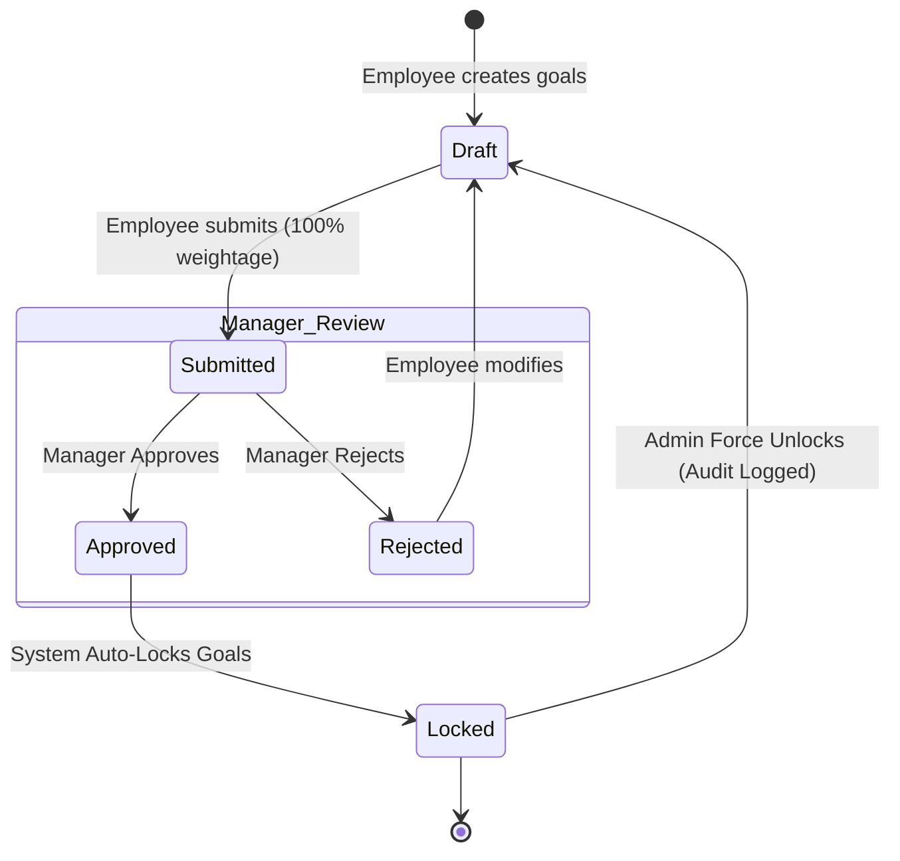
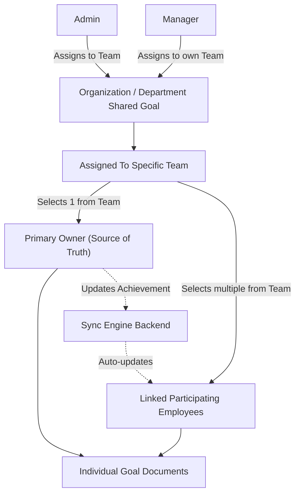
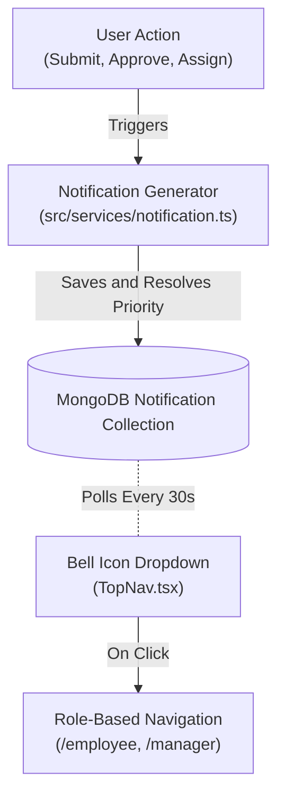
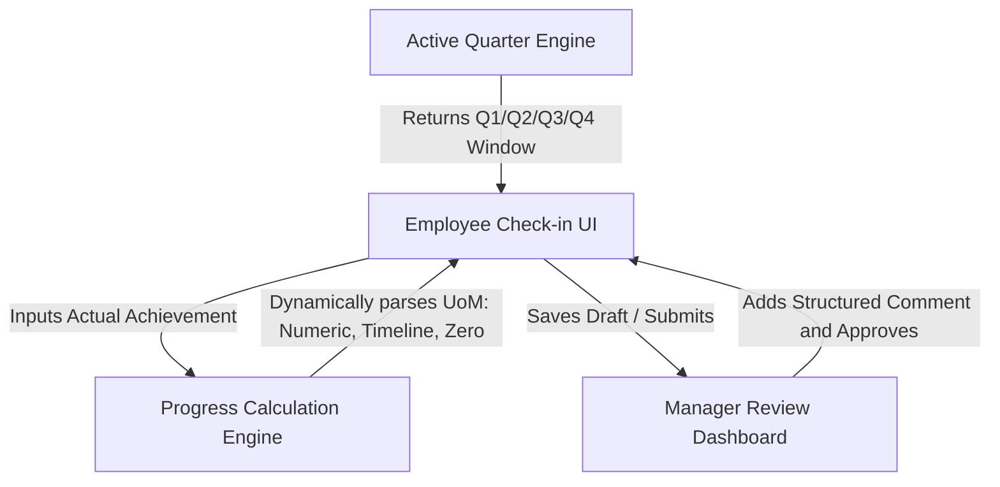
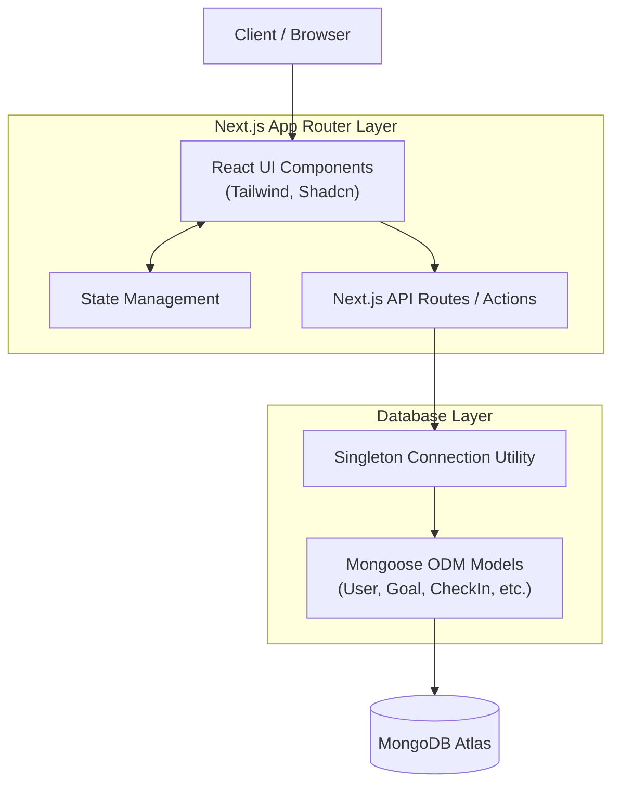
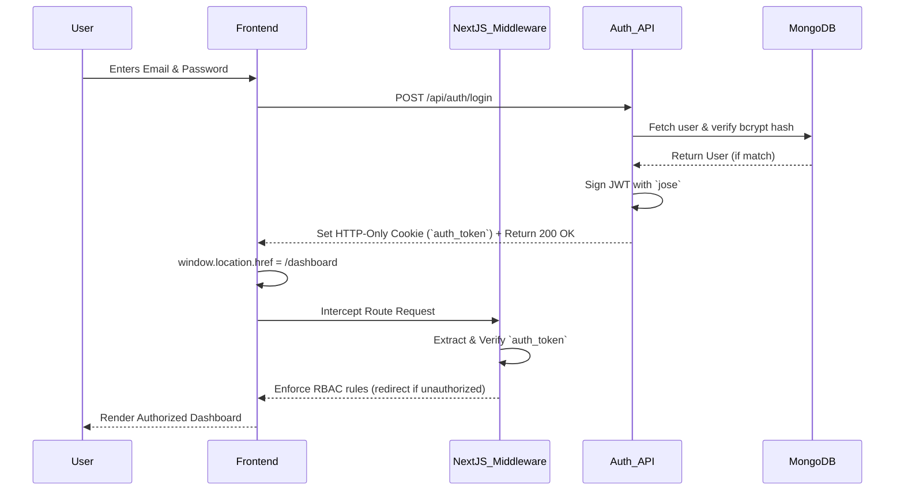
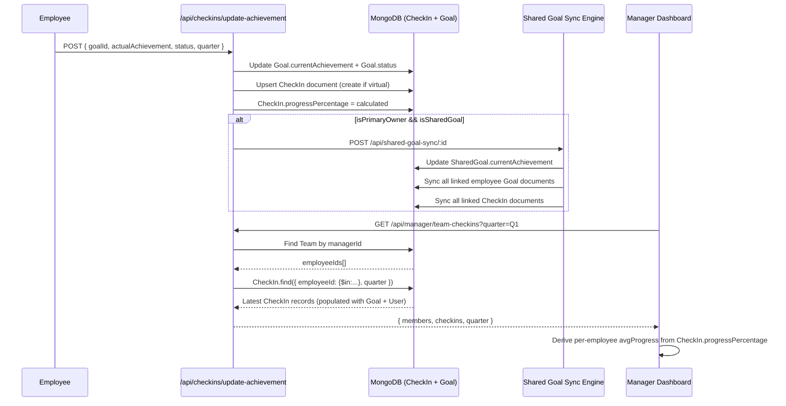
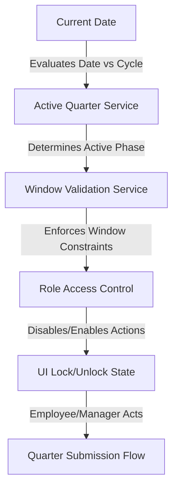
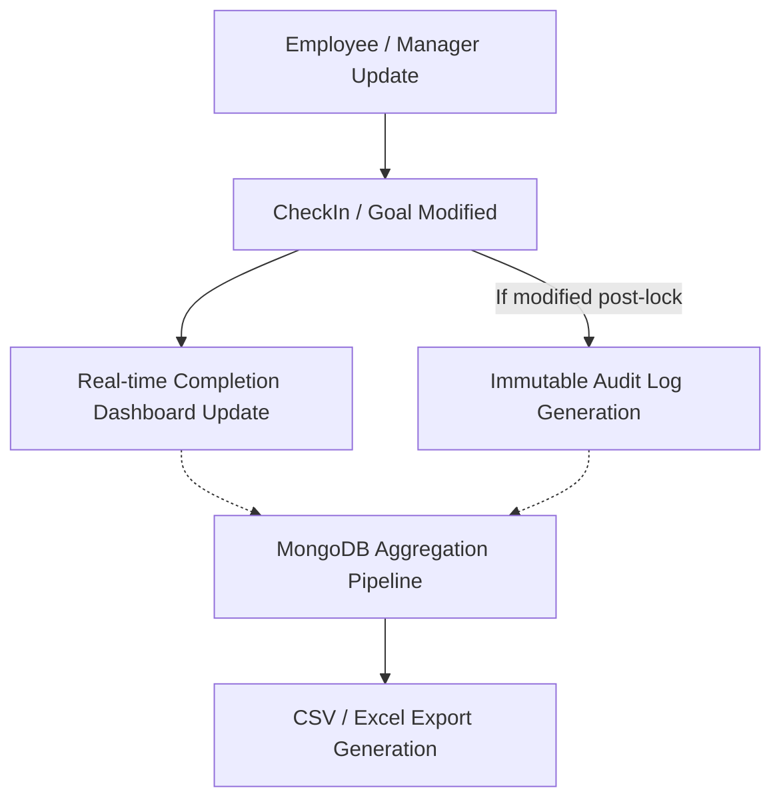

# AtomQuest Goal Setting & Tracking Portal

AtomQuest is a premium, enterprise-grade Goal Setting and Tracking Portal designed to modernize employee performance management with real-time KPI tracking and quarterly check-ins. This platform enables employees to set goals, managers to review and approve them, and administrators to gain insights into organizational progress.

## Overview

This repository contains the foundation for the AtomQuest portal. It is built to deliver a highly user-friendly, responsive, and minimalist experience reminiscent of modern SaaS platforms (like Notion, Linear, and Stripe).

### Features
- **[Phase 1] Goal Creation & Employee Dashboard (COMPLETED)**
- **[Phase 1] Dynamic Manager Dashboard & Approval System (COMPLETED)**
- **[Phase 1] Real-time Shared Goals Management (COMPLETED)**
- **[Phase 1] System-wide Notifications & Alerts (COMPLETED)**
- **[Phase 2] Quarterly Check-ins & Continuous Feedback (COMPLETED)**
- [Phase 3] Advanced Analytics & PDF Exporting

---

## 🏗 Phase 1 Architecture (Implemented)

### 1. Goal Lifecycle Workflow



### 3. Enterprise Shared Goals & KPI Syncing



- `GET/POST /api/shared-goals` - Admin/Manager creation of team-linked shared goals.
- `PUT /api/shared-goals/:id/update-achievement` - Only executable by the `Primary Owner`. Triggers the `bulkWrite` sync engine.
- `POST /api/shared-goal-sync/:id` - Internal sync engine propagating actuals to all linked active quarterly check-ins.

### 4. Notification Architecture & Event Flow



- `GET /api/notifications` - Fetch latest unread/read notifications for the logged-in user.
- `PUT /api/notifications/read-all` - Mark all notifications as read.
- `PUT /api/notifications/:id/read` - Mark a single notification as read.
- `DELETE /api/notifications/:id` - Delete a specific notification.

---

## 🚀 Phase 2 Architecture (Implemented)

### 1. Quarterly Check-in & Review Flow



### 2. Supported Progress Calculation (UoM Engine)

The core calculation logic seamlessly interprets progress based on how the goal was originally parameterized:
- **Min / Percentage**: Progress scales based on maximum limits (e.g. `(Target / Actual) * 100` for cost, or `(Actual / Target) * 100` for revenue).
- **Timeline**: Returns 100% if completed before target date; deducts scale based on days delayed.
- **Zero Type**: Assumes binary state. `0 = 100% Success` (e.g., Target: 0 Accidents).

#### API Documentation
- `GET /api/checkins/active-quarter` - Retrieve the currently enforced Check-in Window based on fiscal year setup.
- `GET/PUT /api/checkins` - Employee CRUD operations for quarterly drafts.
- `POST /api/checkins/submit` - Irreversible quarter submission locking the employee form.
- `POST /api/checkins/review` - Manager route to persist structured comments.
- `POST /api/progress/calculate` - Independent service routing calculation math.

---

## 🔒 Security & Middleware

- **Role-based Authentication**: Secure access for Employees, Managers, and Admins.

## Tech Stack

- **Frontend**: Next.js 15 (App Router), TypeScript, Tailwind CSS
- **UI Architecture**: Shadcn UI, Framer Motion, Lucide React
- **Backend Architecture**: Next.js API Routes (Serverless)
- **Database Architecture**: MongoDB Atlas with Mongoose ODM

## Architecture Diagram



## Database Schema Overview
The architecture implements the following robust Mongoose schemas:
- **User**: Captures identity, roles (employee, manager, admin), and relationships.
- **Goal**: Core entity tracking targets, thrust areas, and quarterly weightings. Supports dynamic Unit of Measurement (`numeric`, `percentage`, `timeline`, `zero`) via `targetValue` and `targetDate`.
- **GoalSheet**: Container linking multiple goals to a specific quarter/year for an employee. Contains strict `status` and `locked` control layers for the approval workflow.
- **CheckIn**: Periodic updates on active goals with manager review hooks.
- **SharedGoal**: Junction allowing shared progress on cross-departmental tasks. Fully integrated for Admin and Manager creation.
- **AuditLog**: Immutable historical tracking of all significant changes (Status changes, Locking, Rejections).
- **Notification**: Real-time event tracking schema. Fields include `recipientId`, `type`, `title`, `message`, `priority` (`low`, `medium`, `high`, `urgent`), `isRead`, and deep `link` references.

## Authentication Flow & RBAC

AtomQuest utilizes a robust, Next.js Edge-compatible JWT authentication system secured by MongoDB and `bcryptjs`.



## Setup Instructions

### Prerequisites
- Node.js 18+
- npm or yarn or pnpm
- A MongoDB Atlas Cluster URL

### Run Locally

1. Clone the repository and navigate into the project directory.
2. Copy the example environment variables:
   ```bash
   cp .env.example .env.local
   ```
3. Update `.env.local` with your secure MongoDB connection string:
   ```
   MONGODB_URI=mongodb+srv://<username>:<password>@cluster...
   ```
4. Install dependencies:
   ```bash
   npm install
   ```
5. Start the development server:
   ```bash
   npm run dev
   ```
6. Open [http://localhost:3000](http://localhost:3000) in your browser.
7. Test the database connection by visiting `http://localhost:3000/api/test-db`.

## Deployment Instructions

### Frontend (Vercel)
The Next.js application is optimized for deployment on Vercel. Connect your repository to Vercel, ensure you provide the `MONGODB_URI` environment variable, and it will automatically configure the build settings.

## Future Roadmap

- Build the dynamic OKR alignment engine.
- Establish the comprehensive Analytics module and detailed Audit Logging integrations.

---

## 🔄 Phase 2 Sync Architecture — Employee → Manager

### Employee Achievement → Manager Dashboard Data Flow



### Source of Truth Design

| Data Point | Source Collection | Used By |
|---|---|---|
| Employee quarterly progress | `CheckIn.progressPercentage` | Manager Dashboard, Check-in Review |
| Goal achievement | `Goal.currentAchievement` | Employee Dashboard, Shared Goal Sync |
| Submission status | `CheckIn.checkinSubmitted` | Manager Review Queue |
| Review status | `CheckIn.managerReviewed` | Employee feedback panel |
| Team composition | `Team.employeeIds` | All manager-scoped queries |
| Org-level KPIs | `SharedGoal` | Admin + Manager shared-goals pages |

### Key Architectural Decisions

- **`CheckIn` is the quarterly source of truth** — the Manager Dashboard reads `CheckIn.progressPercentage`, never `Goal.status` counts.
- **`Team` collection drives scoping** — all manager queries use `Team.findOne({ managerId })`, not `User.managerId` field, ensuring hierarchy integrity.
- **Virtual check-ins** — employees without a persisted `CheckIn` get a virtual one generated on the fly from the `Goal` document, which becomes real on first save.
- **`router.refresh()`** — the Manager Dashboard uses Next.js's `router.refresh()` to re-run the server component and pull fresh MongoDB data without a full page reload.
- **Shared Goal Primary Owner sync** — when a primary owner saves progress, `/api/checkins/update-achievement` fires a background sync to `shared-goal-sync/:id`, which propagates the achievement to all linked employee `Goal` and `CheckIn` documents.

---

## 🎯 Phase 3 Architecture: Goal Cycle Management System

### Active Quarter & Window Enforcement Engine



### Key Components

- **Database-Driven Cycles**: Admin configures a specific `GoalCycle` with discrete dates for Goal Setting, Q1, Q2, Q3, and Q4 windows.
- **Active Quarter Service**: Determines dynamically on the backend what the current cycle status is (`GOAL_SETTING`, `Q1`, `Q2`, `Q3`, `Q4`, or `LOCKED`).
- **Strict Backend Enforcement**: `Window Validation Service` blocks API routes outside of authorized windows. For example, check-ins cannot be saved if the window is closed.
- **Admin Overrides**: Administrators can apply a temporary override to reopen a specific phase globally or for targeted employees (audit-logged).
- **Auto Transitions**: No manual switching. As time progresses, the system automatically advances the state to the current active window.

---

## 📊 Phase 4 Architecture: Governance & Enterprise Reporting

### Complete Audit & Reporting Data Flow



### Key Components

- **Enterprise Reporting Engine**: Backend-driven CSV and Excel generation using `json2csv` and `ExcelJS`. Relies on MongoDB `$lookup` aggregation pipelines to join Goals, CheckIns, Users, and Teams on the fly without heavy frontend processing.
- **Real-Time Completion Dashboard**: Provides managers and leadership with immediate visibility into department participation, identifying pending and overdue check-ins instantly.
- **Immutable Audit Trail (`AuditLog` Schema)**: Every state mutation (targets, weightages, approvals, admin overrides) is captured permanently. It logs the actor, old value, new value, exact timestamp, and the required override reason.
- **Lock Date Governance**: Post-lock modifications are structurally restricted and require administrative overrides which are forcefully tracked in the Audit Log.
